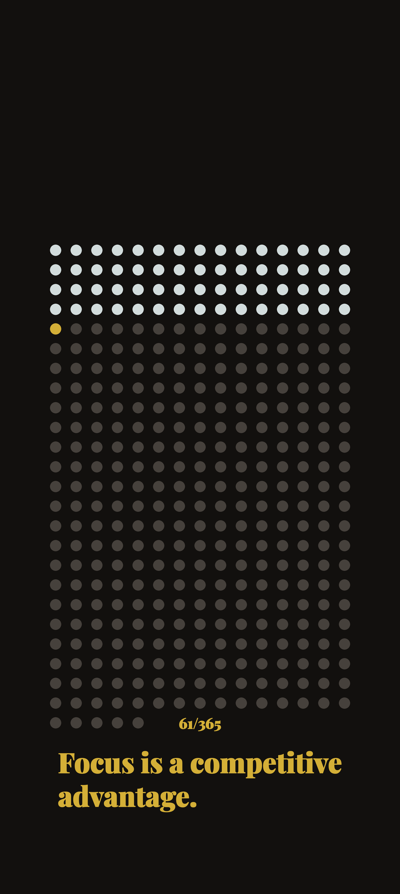

# Life Calendar with quotes
This project is based off Life calendar (https://thelifecalendar.com/). Such a simple idea that was done so well, but I wanted to add a few additions to it that would help me out on a daily basis.

## Features
- Only shows the year of 365 days, but tracks where we are up to in the year, in both dot form and day tracker.
- I have assembled a list of motivational quotes that it will cycle through every day
- Deploys through Github Actions to be published to the github pages for ease of download through through MacroDroid or Automate.

## Github Actions
This id a pretty standard github actions pipeline. Checkouts repo, sets up python env, install dependencies, run python script, creates a public folder for the github pages, uploads the artifact then deploys it. There are other steps that are commented it out, as I was deciding between using google drive or github artifacts.

Daily wallpaper can be found here:
https://stevenkhuu27.github.io/Life-Calendar/

## To Do items:
- I want to be able to send a message problably through Telegram Bot API, to create a to-do task that I can update my wallpaper with and display.
- Customise wall paper size; potentially based off various phone sizes as inputs to the github actions pipeline.
- Google Drive Integration (https://www.merge.dev/blog/google-drive-api-python).
- Add a 7 day dot timer for this week
- Potentially percent of year done instead of day/year
- Do a Life calendar of years done where each row is a year
- Add identity statements alongside quotes.
- Sundays - reflection question.
- Have a focus of the week line
